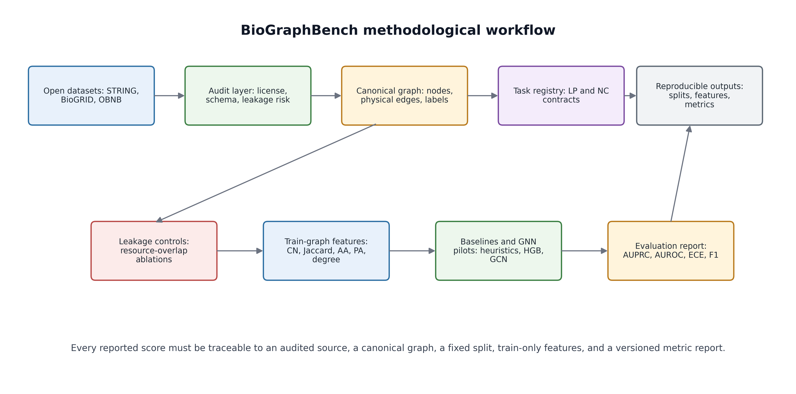

# 3. METODOLOGÍA

## 3.1. Diseño general del benchmark y unidad experimental

BioGraphBench se diseñó como un benchmark reproducible para evaluar aprendizaje sobre grafos biomédicos bajo una restricción central: ningún resultado debe depender de decisiones implícitas de descarga, filtrado, particionado o construcción de features. Por esta razón, el método no inicia con arquitecturas de modelos, sino con una representación auditable de cada tarea. Cada dataset se transforma en un objeto experimental compuesto por nodos, aristas, atributos, etiquetas, metadatos de procedencia y particiones versionadas:

$$
\mathcal{B}_k=\left(\mathcal{G}_k,\mathcal{T}_k,\mathcal{S}_k,\Phi_k,\mathcal{M}_k\right), \qquad
\mathcal{G}_k=(V_k,E_k,X_k,Y_k).
\tag{1}
$$

En la Ecuación (1), $\mathcal{B}_k$ representa la instancia benchmark para el dataset $k$; $\mathcal{G}_k$ es el grafo canónico; $\mathcal{T}_k$ define la tarea; $\mathcal{S}_k$ contiene los splits; $\Phi_k$ define las funciones de características, y $\mathcal{M}_k$ define las métricas. Esta formulación obliga a que cualquier comparación futura, incluyendo GNNs, declare exactamente qué grafo, qué tarea, qué split y qué métricas está usando.

La unidad mínima de evaluación se define de forma distinta según la familia de tarea. Para predicción de enlaces, la unidad es un par no dirigido de proteínas $(u,v)$; para clasificación de nodos, la unidad es una proteína $v$ con un vector multilabel de funciones biológicas. Formalmente:

$$
z_i =
\begin{cases}
(u_i,v_i,y_i), & \text{si } \mathcal{T}_k \text{ es predicción de enlaces},\\
(v_i,\mathbf{y}_i), & \text{si } \mathcal{T}_k \text{ es clasificación multilabel de nodos}.
\end{cases}
\tag{2}
$$

Esta definición separa claramente el objeto biológico observado de la tarea estadística que se construye sobre él. El objetivo no es maximizar una métrica aislada, sino asegurar que cada $z_i$ sea reconstruible desde los artefactos públicos del benchmark.



**Figure 5. Methodological workflow of BioGraphBench.** The pipeline starts from open biological resources, applies audit and canonicalization rules, defines task contracts and leakage controls, computes train-graph features, evaluates baselines and produces versioned reports.

La Figura 5 resume el flujo metodológico. El elemento crítico es que los modelos aparecen tarde en el pipeline: antes se auditan fuentes, se normaliza el grafo, se define la tarea, se controla leakage y se fijan features calculables solo desde el grafo de entrenamiento. Esta decisión reduce el riesgo de que el benchmark mida disponibilidad accidental de datos o solapamiento entre recursos en lugar de aprendizaje estructural.

## 3.2. Selección, auditoría y canonicalización de datasets

Los datasets candidatos se evaluaron mediante una matriz de auditabilidad que considera apertura, trazabilidad, descarga completa, licencia, esquema, identificadores y posibilidad de reconstrucción. Un recurso se acepta únicamente si satisface simultáneamente criterios mínimos de disponibilidad, claridad semántica y utilidad experimental:

$$
A(d)=\mathbb{1}\left[
L_d=1 \land R_d=1 \land C_d=1 \land U_d=1
\right],
\tag{3}
$$

donde $L_d$ indica licencia o términos de uso compatibles, $R_d$ reproducibilidad de descarga, $C_d$ claridad del esquema y $U_d$ usabilidad para una tarea de grafo. Esta regla evita incluir datasets que parezcan atractivos pero no puedan auditarse o descargarse completamente.

Después de seleccionar un recurso, las aristas se convierten a una forma canónica no dirigida. Para toda interacción física entre proteínas $u$ y $v$, BioGraphBench registra una sola arista ordenada lexicográficamente:

$$
\operatorname{canon}(u,v)=\left(\min(u,v),\max(u,v)\right), \qquad
E=\{\operatorname{canon}(u,v):(u,v)\in E_{\mathrm{raw}},u\neq v\}.
\tag{4}
$$

La Ecuación (4) elimina duplicados inducidos por orden, autointeracciones y registros redundantes. En STRING y BioGRID se retienen interacciones físicas humanas; en OBNB se conserva la relación entre proteínas y anotaciones GOBP cuando estas pueden asociarse a nodos presentes en la red PPI. Esta decisión hace que las tareas de link prediction y node classification compartan un espacio de nodos comparable.

## 3.3. Definición de tareas, particionado y control de leakage

Para predicción de enlaces, las aristas positivas se dividen en entrenamiento, validación y prueba mediante una partición disjunta y reproducible:

$$
E^+=E^+_{\mathrm{train}}\dot{\cup}E^+_{\mathrm{val}}\dot{\cup}E^+_{\mathrm{test}}, \qquad
E^+_a\cap E^+_b=\varnothing \; \forall a\neq b.
\tag{5}
$$

El grafo usado para calcular features y entrenar modelos contiene únicamente $E^+_{\mathrm{train}}$. Esto impide que una feature estructural use vecindarios formados por aristas de validación o prueba. Los negativos se muestrean desde el complemento del grafo observado, excluyendo pares positivos y preservando una proporción controlada:

$$
E^-_s \subseteq \binom{V}{2}\setminus E^+, \qquad
\rho_s=\frac{|E^-_s|}{|E^+_s|}, \quad s\in\{\mathrm{train},\mathrm{val},\mathrm{test}\}.
\tag{6}
$$

Las tareas de ablación STRING/BioGRID agregan un segundo control: remover del conjunto evaluado aquellos pares que aparecen como positivos en el otro recurso. Si $E^{(a)}$ y $E^{(b)}$ son dos fuentes PPI, la variante sin solapamiento se define como:

$$
E^{(a\setminus b)}_{\mathrm{eval}}=\{e\in E^{(a)}_{\mathrm{eval}}:e\notin E^{(b)}\}.
\tag{7}
$$

La Ecuación (7) no afirma independencia biológica total entre recursos, pero sí reduce una forma concreta de leakage por reutilización de interacciones ya registradas en otra base. En node classification, el split se realiza sobre nodos y las etiquetas GOBP se mantienen fuera de las features estructurales. Así, la evaluación pregunta si la estructura PPI permite recuperar funciones biológicas sin usar la etiqueta como atributo.

## 3.4. Extracción de features, baselines y modelos

Las features de predicción de enlaces se calculan exclusivamente sobre el grafo de entrenamiento $G_{\mathrm{train}}=(V,E^+_{\mathrm{train}})$. Para un par $(u,v)$ se define el vector estructural:

$$
\phi(u,v)=\left[
\mathrm{CN}(u,v),\mathrm{Jaccard}(u,v),\mathrm{AA}(u,v),
\mathrm{PA}(u,v),\deg(u),\deg(v)
\right],
\quad
\mathrm{CN}=|\Gamma(u)\cap\Gamma(v)|,\quad
\mathrm{Jaccard}=\frac{|\Gamma(u)\cap\Gamma(v)|}{|\Gamma(u)\cup\Gamma(v)|},
\quad
\mathrm{AA}=\sum_{w\in\Gamma(u)\cap\Gamma(v)}\frac{1}{\log(\deg(w)+\epsilon)},\quad
\mathrm{PA}=\deg(u)\deg(v).
\tag{8}
$$

Estas features sirven para dos tipos de modelos: heurísticas puras, donde el score es directamente una función estructural, y modelos supervisados, donde $\phi(u,v)$ alimenta clasificadores como Logistic Regression, Random Forest e HistGradientBoosting. Para link prediction y node classification multilabel, las pérdidas se definen como:

$$
\mathcal{L}_{\mathrm{LP}}(\theta)=
-\frac{1}{n}\sum_{i=1}^{n}
\left[y_i\log \hat{p}_\theta(u_i,v_i)+(1-y_i)\log(1-\hat{p}_\theta(u_i,v_i))\right],
\quad
\mathcal{L}_{\mathrm{NC}}(\theta)=
-\frac{1}{|V_{\mathrm{train}}|C}
\sum_{v\in V_{\mathrm{train}}}\sum_{c=1}^{C}
\left[y_{vc}\log \hat{p}_{vc}+(1-y_{vc})\log(1-\hat{p}_{vc})\right].
\tag{9}
$$

**Algoritmo 1. Protocolo reproducible de BioGraphBench.**

```text
Input:
  Datasets candidatos D, semilla r, razones de split, métricas M
Output:
  Reportes reproducibles con tareas, splits, features, modelos y métricas

1. Para cada dataset d en D:
2.   Auditar licencia, descarga, esquema, identificadores y cobertura.
3.   Si A(d)=0, excluir d y registrar la causa.
4.   Canonicalizar nodos y aristas; remover duplicados y autointeracciones.
5.   Definir contratos de tarea para link prediction o node classification.
6.   Construir splits reproducibles usando la semilla r.
7.   Para link prediction, muestrear negativos desde el complemento del grafo.
8.   Aplicar controles de leakage y ablaciones de solapamiento cuando corresponda.
9.   Calcular features únicamente desde el grafo de entrenamiento.
10.  Entrenar heurísticas, baselines supervisados y modelos piloto.
11.  Evaluar AUROC, AUPRC, calibración, F1, precision y recall según la tarea.
12.  Exportar matrices, artefactos intermedios, configuración y reportes.
```

## 3.5. Métricas, calibración y garantía de reproducibilidad

La evaluación combina métricas de ranking, métricas de decisión, calibración y trazabilidad. En link prediction se priorizan AUROC y AUPRC, dado que AUPRC es más informativa bajo desbalance entre pares observados y no observados. En node classification se reportan Macro AUROC, Macro AUPRC y métricas microagregadas después de ajustar umbrales en validación. El bloque final de evaluación se define como:

$$
\mathcal{M}=
\{\mathrm{AUROC},\mathrm{AUPRC},\mathrm{ECE},\mathrm{Brier},\mathrm{MicroF1}\},
\quad
\mathrm{ECE}=\sum_{b=1}^{B}\frac{|I_b|}{n}
\left|\operatorname{acc}(I_b)-\operatorname{conf}(I_b)\right|,
\quad
R=f(D_{\mathrm{raw}},C_{\mathrm{audit}},S_r,\Phi,\Theta,\mathcal{M}),
\tag{10}
$$

donde $D_{\mathrm{raw}}$ son los datos originales, $C_{\mathrm{audit}}$ las reglas de auditoría, $S_r$ los splits generados con semilla $r$, $\Phi$ las features, $\Theta$ la configuración de modelos y $\mathcal{M}$ las métricas. Esta definición permite auditar no solo el valor final de una métrica, sino también el camino que llevó a ella.
