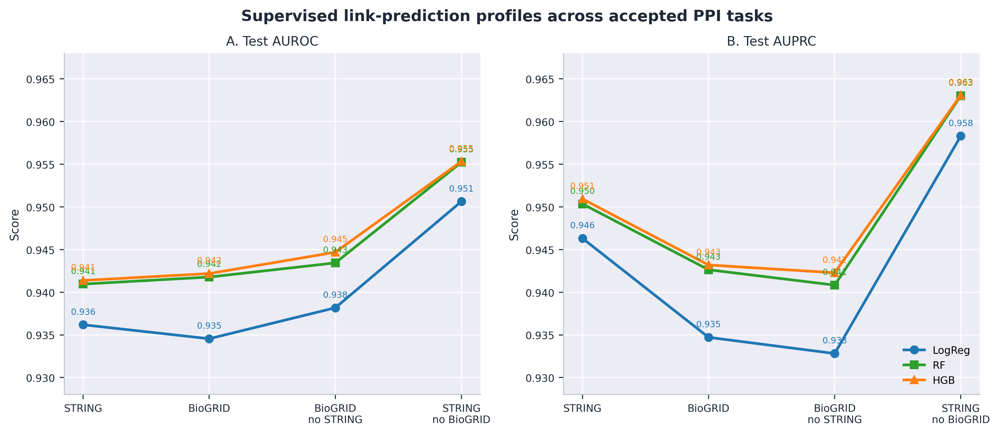
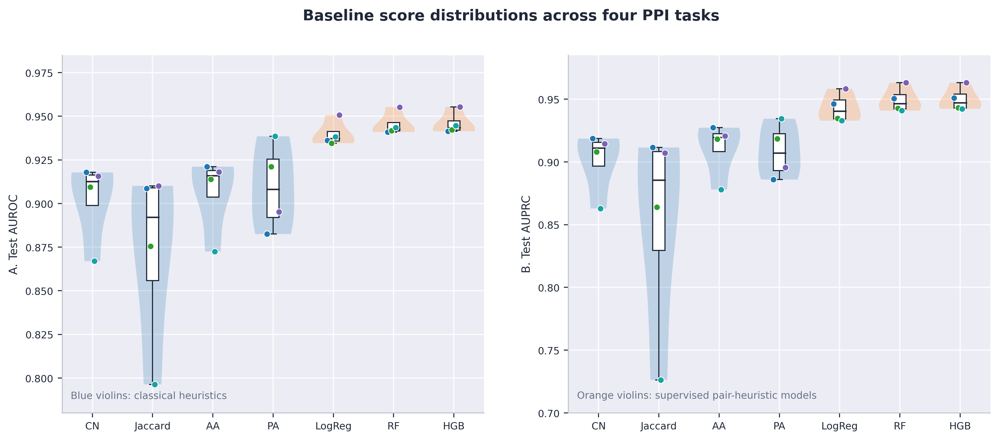
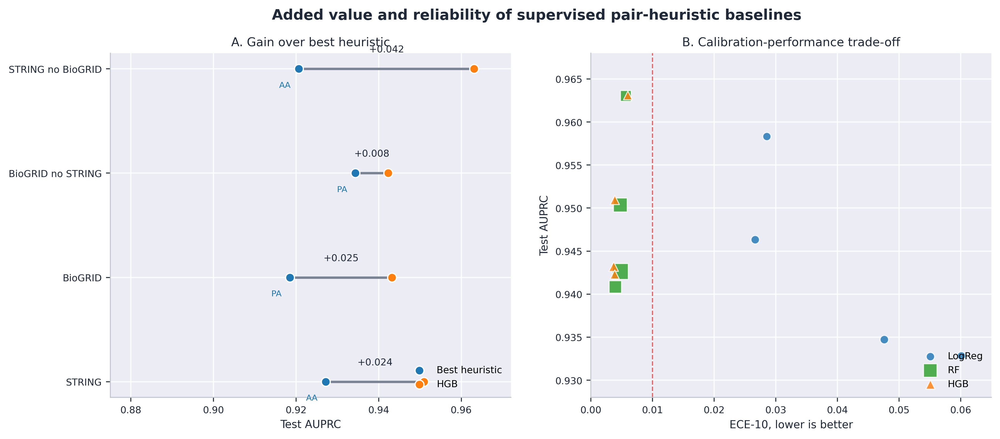
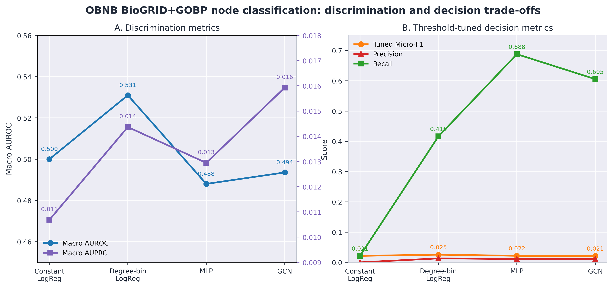

# 4. RESULTADOS

## 4.1. Tareas aceptadas y alcance empírico del benchmark

BioGraphBench fue diseñado bajo una premisa distinta a la de un benchmark centrado exclusivamente en maximizar desempeño de modelos: antes de comparar arquitecturas, el benchmark debe demostrar que sus tareas son auditables, reproducibles y resistentes a leakage. Bajo este criterio, el MVP retiene cinco tareas: cuatro de predicción de enlaces en redes PPI físicas y una de clasificación multilabel de nodos sobre funciones biológicas GOBP. La Tabla 1 resume el contrato experimental de estas tareas y separa explícitamente las tareas principales de las tareas de ablación.

**Tabla 1. Tareas aceptadas en el MVP de BioGraphBench.**

| Task ID | Dataset | Familia | Tipo | Métricas primarias | Rol |
| --- | --- | --- | --- | --- | --- |
| `lp_string_physical` | `string_human_physical_v12` | link_prediction | binary_undirected_edge_prediction | AUROC, AUPRC | main_paper_task |
| `lp_biogrid_physical` | `biogrid_human_physical` | link_prediction | binary_undirected_edge_prediction | AUROC, AUPRC | main_paper_task |
| `lp_biogrid_no_string_overlap` | `biogrid_human_physical_no_string_overlap` | link_prediction | binary_undirected_edge_prediction | AUROC, AUPRC | overlap_ablation_task |
| `lp_string_no_biogrid_overlap` | `string_human_physical_no_biogrid_overlap` | link_prediction | binary_undirected_edge_prediction | AUROC, AUPRC | overlap_ablation_task |
| `nc_obnb_biogrid_gobp` | `obnb_biogrid_gobp` | node_classification | multilabel_node_classification | Macro AUROC, Macro AUPRC | secondary_challenge_task |

El resultado metodológico más importante de la Tabla 1 no es el número de tareas, sino su heterogeneidad controlada. Las dos tareas principales de link prediction (`STRING` y `BioGRID`) permiten evaluar aprendizaje estructural sobre redes PPI físicas; las dos variantes sin solapamiento permiten probar si los resultados sobreviven cuando se remueven pares compartidos entre recursos; y `obnb_biogrid_gobp` introduce una tarea de node classification mucho más desbalanceada y menos trivial. Así, el benchmark no depende de una única lectura de desempeño: combina señal topológica fuerte, controles de independencia parcial y una tarea funcional difícil.

## 4.2. Predicción de enlaces en redes PPI: heurísticas fuertes y modelos supervisados

La primera pregunta empírica es si las tareas PPI son suficientemente difíciles como para justificar modelos más complejos. Los resultados muestran una respuesta matizada: las heurísticas clásicas son sorprendentemente fuertes, pero los modelos supervisados sobre heurísticas de pares todavía añaden ganancia consistente. Esto es crucial para BioGraphBench porque establece una vara mínima: cualquier GNN futura debe superar no solo baselines triviales, sino también heurísticas estructurales bien calibradas.

**Tabla 2. Mejor heurística clásica versus mejor baseline supervisado en link prediction.**

| Dataset | Mejor heurística | AUPRC heurística | AUROC HGB | AUPRC HGB | Ganancia AUPRC |
| --- | --- | --- | --- | --- | --- |
| STRING | adamic_adar | 0.927 | 0.941 | 0.951 | +0.024 |
| BioGRID | preferential_attachment | 0.919 | 0.942 | 0.943 | +0.025 |
| BioGRID no STRING | preferential_attachment | 0.934 | 0.945 | 0.942 | +0.008 |
| STRING no BioGRID | adamic_adar | 0.921 | 0.955 | 0.963 | +0.042 |

En la Tabla 2, HistGradientBoosting (HGB) alcanza AUPRC entre 0,942 y 0,963 en las cuatro tareas PPI. La magnitud de estos valores no debe interpretarse como evidencia de que la tarea esté resuelta biológicamente. Más bien, indica que las redes PPI físicas poseen regularidades topológicas muy fuertes: nodos con vecindarios compartidos, conectividad preferencial y concentración de grado ya explican gran parte de la separabilidad entre pares positivos y negativos. El caso más ilustrativo es `biogrid_human_physical_no_string_overlap`, donde Preferential Attachment alcanza AUPRC=0,934 y HGB solo mejora a 0,942. En esta variante, remover solapamiento directo con STRING no destruye la señal topológica; al contrario, revela que parte sustancial de la predictibilidad proviene de la organización global de la red.

**Figure 1. Supervised link-prediction metric profiles across accepted PPI tasks.** Panel A reports test AUROC and Panel B reports test AUPRC for logistic regression, random forest and HistGradientBoosting trained on train-graph pair heuristics.

La Figura 1 muestra que los perfiles de AUROC y AUPRC son paralelos para Random Forest y HGB, con diferencias pequeñas pero sistemáticas a favor de HGB. En AUROC, HGB se mueve en un rango estrecho de 0,941 a 0,955, mientras que Random Forest queda prácticamente superpuesto entre 0,941 y 0,955. En AUPRC ocurre algo similar: HGB oscila entre 0,942 y 0,963, y Random Forest entre 0,941 y 0,963. La lectura importante no es que HGB gane por amplio margen, sino que el techo de desempeño no neuronal ya es alto y estable. Logistic regression queda por debajo en todas las tareas, con caídas más visibles en BioGRID y BioGRID sin STRING, donde su AUPRC baja a 0,935 y 0,933, respectivamente. Esto sugiere que una combinación lineal de heurísticas no captura completamente interacciones no lineales entre grado, vecindad compartida y conectividad local. Para BioGraphBench, esta figura define el umbral empírico mínimo: una GNN que no supere aproximadamente AUPRC=0,94-0,96 en PPI no estaría aportando evidencia fuerte de aprendizaje adicional.

**Figure 2. Baseline score distributions across the accepted PPI tasks.** Panel A summarizes test AUROC and Panel B summarizes test AUPRC using violin distributions, box summaries and task-level points for classical heuristics and supervised pair-heuristic models.

La Figura 2 permite observar algo que la tabla oculta: no todas las heurísticas fallan del mismo modo ni tienen la misma estabilidad entre datasets. Jaccard es el caso más débil y variable: su AUPRC cae hasta 0,726 en BioGRID sin STRING, a pesar de mantenerse por encima de 0,90 en STRING y STRING sin BioGRID. Esta sensibilidad indica que normalizar por la unión de vecindarios penaliza con fuerza redes donde el patrón dominante no es vecindad local compartida sino conectividad por grado. Adamic-Adar, por el contrario, se mantiene en una banda más estable, con AUPRC entre 0,878 y 0,927; Preferential Attachment alcanza 0,934 en BioGRID sin STRING y supera a Adamic-Adar en las tareas BioGRID, lo que revela una señal de grado particularmente fuerte en esa red. Los modelos supervisados forman una distribución compacta en la región superior: Logistic Regression, Random Forest y HGB concentran sus valores por encima de 0,932. Esta compactación es científicamente relevante porque muestra que la supervisión no solo eleva el desempeño, sino que reduce la dependencia del baseline respecto al sesgo estructural específico de cada red.

## 4.3. Ganancia supervisada, calibración y confiabilidad de los baselines

La segunda pregunta empírica es si la ganancia de los modelos supervisados representa una mejora sustantiva o simplemente una redistribución marginal de scores. Para responderlo, comparamos el mejor baseline clásico de cada tarea contra HGB y analizamos simultáneamente calibración mediante ECE-10, Brier score y tiempo de entrenamiento.

**Tabla 3. Calibración y costo de modelos supervisados en link prediction.**

| Dataset | Modelo | AUPRC | Brier | ECE-10 | Train s |
| --- | --- | --- | --- | --- | --- |
| STRING | logistic_regression | 0.946 | 0.0975 | 0.0267 | 1.61 |
| STRING | random_forest | 0.950 | 0.0917 | 0.0048 | 35.59 |
| STRING | hist_gradient_boosting | 0.951 | 0.0916 | 0.0039 | 5.32 |
| BioGRID | logistic_regression | 0.935 | 0.1054 | 0.0476 | 1.82 |
| BioGRID | random_forest | 0.943 | 0.0959 | 0.0048 | 53.20 |
| BioGRID | hist_gradient_boosting | 0.943 | 0.0956 | 0.0037 | 7.41 |
| BioGRID no STRING | logistic_regression | 0.933 | 0.1040 | 0.0601 | 1.22 |
| BioGRID no STRING | random_forest | 0.941 | 0.0943 | 0.0040 | 25.69 |
| BioGRID no STRING | hist_gradient_boosting | 0.942 | 0.0935 | 0.0039 | 4.80 |
| STRING no BioGRID | logistic_regression | 0.958 | 0.0845 | 0.0286 | 0.75 |
| STRING no BioGRID | random_forest | 0.963 | 0.0767 | 0.0057 | 14.26 |
| STRING no BioGRID | hist_gradient_boosting | 0.963 | 0.0769 | 0.0060 | 3.38 |

La Tabla 3 muestra un patrón consistente: HGB y Random Forest obtienen AUPRC similares, pero HGB tiende a entrenar mucho más rápido y a mantener ECE-10 bajo. En `STRING`, por ejemplo, Random Forest alcanza AUPRC=0,950 con 35,59 s de entrenamiento, mientras que HGB alcanza AUPRC=0,951 con 5,32 s. En `BioGRID`, la diferencia de tiempo es aún mayor: 53,20 s frente a 7,41 s. Esto posiciona a HGB como baseline supervisado preferente para el MVP: no necesariamente porque domine todas las métricas por amplio margen, sino porque ofrece buen desempeño, calibración razonable y costo computacional menor.

**Figure 3. Added value and reliability of supervised pair-heuristic baselines.** Panel A shows the paired AUPRC gain from the best classical heuristic to HGB for each PPI task. Panel B shows test AUPRC versus ECE-10, with marker size proportional to training time.

La Figura 3(a) cuantifica la ganancia de pasar de la mejor heurística clásica a HGB. La ganancia es mayor en `STRING no BioGRID` (+0,042), seguida de BioGRID (+0,025) y STRING (+0,024), mientras que cae a +0,008 en `BioGRID no STRING`. Esta asimetría es informativa: cuando una heurística como Preferential Attachment ya captura la estructura dominante, el margen para supervisión adicional disminuye; cuando la estructura local no basta, el modelo supervisado combina señales de forma más efectiva. En otras palabras, la ganancia supervisada no es uniforme; depende de qué componente topológico domina la red después del filtrado. La Figura 3(b) añade una dimensión de confiabilidad. Logistic Regression puede obtener AUPRC competitivo en `STRING no BioGRID` (0,958), pero su ECE-10 es 0,0286, casi cinco veces mayor que HGB (0,0060). En BioGRID sin STRING, el contraste es aún más fuerte: Logistic Regression alcanza ECE-10=0,0601, mientras HGB queda en 0,0039. Esto significa que un modelo puede ordenar pares relativamente bien y aun así producir probabilidades poco confiables. Por esta razón, BioGraphBench debe reportar calibración junto con ranking: en aplicaciones biomédicas downstream, un score mal calibrado puede inducir priorizaciones experimentales engañosas.

## 4.4. Clasificación multilabel de nodos: una tarea difícil y desbalanceada

La tarea `obnb_biogrid_gobp` cuenta una historia diferente a link prediction. Aquí, features estructurales simples no bastan para producir desempeño fuerte, y el GCN piloto tampoco resuelve el problema. La Tabla 4 resume los resultados de clasificación multilabel usando features constantes, degree-bin logistic regression, MLP y GCN con threshold tuning por tarea seleccionado sobre validación.

**Tabla 4. Resultados de node classification en OBNB BioGRID+GOBP.**

| Modelo | Feature | Macro AUROC | Macro AUPRC | Micro-F1 | Precision | Recall |
| --- | --- | --- | --- | --- | --- | --- |
| constant_logreg | constant | 0.500 | 0.011 | 0.021 |  |  |
| logistic_regression | one_hot_log_degree | 0.531 | 0.014 | 0.025 | 0.013 | 0.416 |
| mlp | one_hot_log_degree | 0.488 | 0.013 | 0.022 | 0.011 | 0.688 |
| gcn | one_hot_log_degree | 0.494 | 0.016 | 0.021 | 0.011 | 0.605 |

La Tabla 4 muestra que `one_hot_log_degree` mejora el control constante en Macro AUROC, pero la mejora no transforma la tarea en un problema fácil. Logistic regression con bins de grado alcanza Macro AUROC=0,531 y Macro AUPRC=0,014, apenas por encima del control constante en AUPRC. El GCN alcanza la mejor Macro AUPRC del conjunto (0,016), pero su Micro-F1 threshold-tuned queda en 0,021. Esta divergencia entre ranking y decisión revela un problema central: el modelo puede ordenar algunos labels raros ligeramente mejor, pero convertir scores en decisiones multilabel confiables sigue siendo difícil.

**Figure 4. OBNB BioGRID+GOBP node-classification trade-offs.** Panel A compares discrimination metrics, Macro AUROC and Macro AUPRC. Panel B compares threshold-tuned Micro-F1, precision and recall.

La Figura 4(a) muestra que Macro AUROC y Macro AUPRC no seleccionan necesariamente el mismo modelo: logistic regression con degree bins maximiza AUROC (0,531), mientras que GCN maximiza AUPRC (0,016). La diferencia parece pequeña en escala absoluta, pero es relevante porque el control constante ya tiene Macro AUPRC=0,011; por tanto, el GCN mejora aproximadamente 49% sobre el control en AUPRC relativa, aunque sigue lejos de una tarea resuelta. El MLP, pese a ser más flexible que logistic regression, cae a Macro AUROC=0,488 y Macro AUPRC=0,013, lo que sugiere que mayor capacidad no garantiza mejor señal bajo features estructurales tan simples. La Figura 4(b) revela el costo del threshold tuning: MLP y GCN alcanzan recall alto (0,688 y 0,605), pero con precision extremadamente baja (0,011 en ambos casos), lo que mantiene Micro-F1 en 0,022 y 0,021. Logistic Regression presenta un equilibrio menos agresivo: recall=0,416, precision=0,013 y Micro-F1=0,025, el mejor F1 de la tabla. En otras palabras, el problema no es solo aprender embeddings o propagar información por la red; también es calibrar decisiones multilabel bajo prevalencias muy bajas sin convertir el modelo en un predictor excesivamente positivo.

## 4.5. Implicaciones empíricas para futuras GNNs en BioGraphBench

Los resultados anteriores permiten transformar BioGraphBench de una colección de datasets en un instrumento de evaluación con criterios empíricos explícitos. La implicación principal es que el benchmark no debe premiar complejidad arquitectónica por sí misma. En link prediction, la topología de PPI es tan informativa que modelos no neuronales ya alcanzan AUPRC superior a 0,94 en todas las tareas aceptadas. Por tanto, una GNN futura tendría que demostrar una mejora sobre HGB y Random Forest, no simplemente superar heurísticas débiles. Además, tendría que hacerlo conservando calibración comparable: HGB mantiene ECE-10 entre 0,0037 y 0,0060, mientras Logistic Regression llega hasta 0,0601. Esto define un criterio doble: desempeño de ranking y confiabilidad probabilística.

En node classification, el criterio es distinto. La tarea `obnb_biogrid_gobp` no exige superar un baseline fuerte de AUPRC alto, sino resolver un problema de desbalance donde los modelos actuales apenas logran Macro AUPRC entre 0,013 y 0,016 con features estructurales. Aquí, una GNN útil no debería evaluarse solo por AUROC; debería mejorar Macro AUPRC, Micro-F1 y precision simultáneamente. Un modelo que aumente recall pero mantenga precision alrededor de 0,011 estaría recuperando muchas etiquetas positivas a costa de demasiados falsos positivos, lo que en un contexto de anotación funcional limitaría su utilidad práctica.

**Tabla 5. Criterios empíricos derivados para modelos futuros en BioGraphBench.**

| Familia | Criterio | Evidencia actual | Implicación |
| --- | --- | --- | --- |
| Link prediction PPI | Superar HGB, no solo heurísticas | HGB alcanza AUPRC 0,942-0,963; la mejor heurística llega hasta 0,934 | Una GNN debe mejorar AUPRC y calibración, no solo AUROC |
| Ablaciones STRING/BioGRID | Mantener ganancia tras remover solapamiento | BioGRID no STRING conserva AUPRC HGB=0,942; STRING no BioGRID llega a 0,963 | La mejora debe persistir sin depender de pares compartidos entre recursos |
| Calibración | Reportar probabilidades confiables | HGB mantiene ECE-10 entre 0,0037 y 0,0060; LogReg llega hasta 0,0601 | Modelos futuros deben reportar ECE/Brier junto a AUPRC |
| Node classification | Resolver desbalance multilabel | GCN mejora Macro AUPRC a 0,016 pero Micro-F1 queda en 0,021 | La contribución real requiere mejorar AUPRC sin colapsar precision |
| Reproducibilidad | Estabilidad con múltiples semillas | MVP usa semilla 42; splits y features ya son auditables | La versión final debe reportar media, desviación y pruebas pareadas |

La Tabla 5 resume el valor práctico de esta sección de resultados. BioGraphBench no solo reporta números: convierte esos números en condiciones de evaluación. Para link prediction, el umbral mínimo no es "mejor que azar", sino mejor que HGB sobre heurísticas estructurales de entrenamiento. Para las ablaciones, el requisito es mostrar que la mejora no depende del solapamiento STRING-BioGRID. Para node classification, el desafío es construir modelos que mejoren ranking y decisión multilabel sin explotar únicamente el grado. Finalmente, para una versión publicable más fuerte, estos criterios deben repetirse con múltiples semillas, intervalos de confianza y pruebas pareadas. Esta es la diferencia entre presentar resultados exploratorios y proponer un benchmark reproducible capaz de sostener comparaciones científicas.
